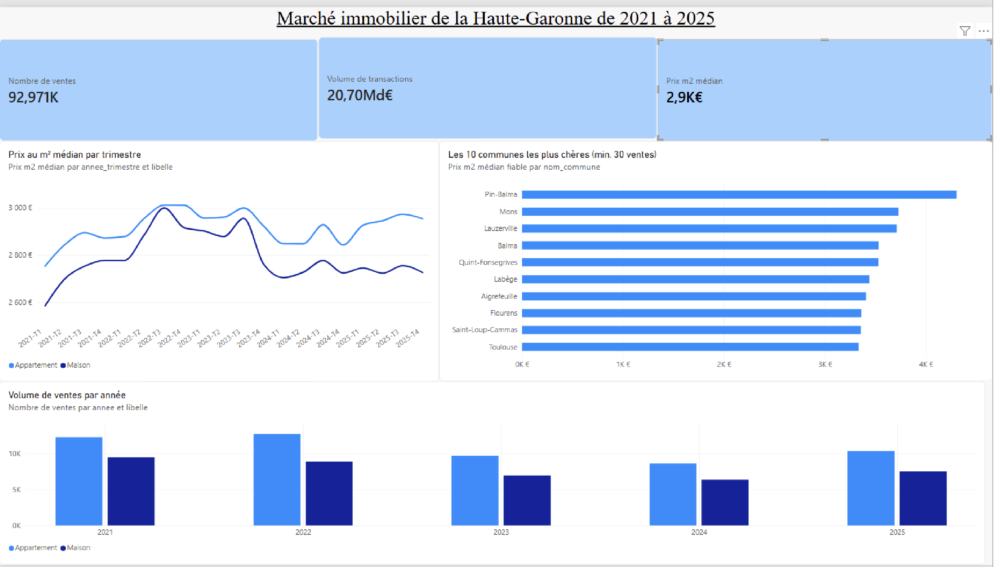
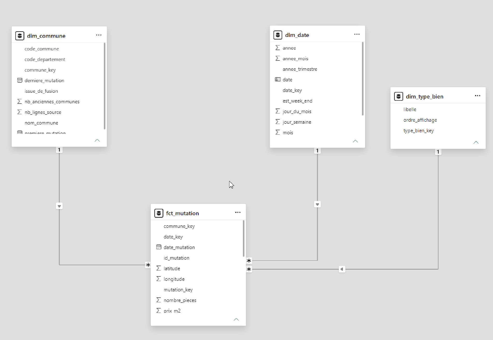
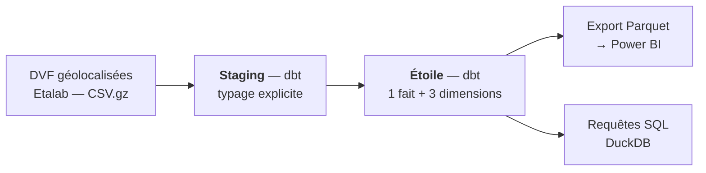

# Entrepôt décisionnel DVF — marché immobilier de la Haute-Garonne

Modélisation en étoile des **Demandes de Valeurs Foncières** (toutes les ventes
immobilières enregistrées en France), restituée dans Power BI.

L'intérêt du projet tient en une phrase : **DVF est un jeu de données piégé, et
ce dépôt montre qu'on connaît le piège.**

## Aperçu



Le schéma en étoile, tel qu'il est monté dans Power BI — une table de faits,
trois dimensions, relations en plusieurs-à-un et sens unique :





| | |
|---|---|
| **Source** | DVF géolocalisées (Etalab), ~6 années, département paramétrable |
| **Moteur** | DuckDB — les CSV compressés sont lus sur place, sans import |
| **Modélisation** | dbt, schéma en étoile, 5 modèles, 24 tests |
| **Restitution** | Power BI Desktop (modèle + mesures DAX fournies) |

---

## Démarrage

```bash
python3 -m venv .venv && source .venv/bin/activate
pip install -r requirements.txt

export DVF_DATA_DIR=$PWD/data
make download     # ~150 Mo, quelques minutes
make explore      # À LIRE : colonnes réelles, volume, et le piège du grain
make dbt          # construit l'étoile et lance les tests
make verifier     # chiffres de contrôle
make export       # Parquet prêt pour Power BI
```

Puis dans Power BI Desktop : **Obtenir des données → Dossier →
`powerbi/exports`**, et suivre [docs/modele.md](docs/modele.md) pour les
relations et [docs/mesures_dax.md](docs/mesures_dax.md) pour les mesures.

Pour un autre département : `python scripts/download.py --dep 34`.

---

## Le piège du grain

DVF éclate chaque vente sur plusieurs lignes — une par lot, par parcelle ou par
local — et **répète la valeur foncière à l'identique sur chacune**.

`SUM(valeur_fonciere)` sur le fichier brut surestime donc le volume de
transactions d'un facteur 2 à 3. L'erreur est invisible : le chiffre obtenu est
plausible, simplement faux.

`fct_mutation` ramène au grain « une vente ». Trois garde-fous rendent cette
garantie vérifiable plutôt que déclarative :

| Contrôle | Ce qu'il garantit |
|---|---|
| `unique` sur `mutation_key` | Le grain est bien une vente, pas une ligne de fichier |
| `assert_valeur_fonciere_non_dupliquee` | La déduplication dédupliquerait encore si quelqu'un cassait la logique |
| `assert_prix_m2_dans_les_bornes` | Aucun prix aberrant n'a contourné le filtre |

`make verifier` affiche l'écart entre la somme naïve et la somme correcte. C'est
le chiffre à citer en entretien.

## Les autres choix, et pourquoi

**Typage explicite plutôt que détection automatique.** Les CSV sont lus en
`all_varchar`, puis convertis colonne par colonne dans `stg_mutations`. DuckDB
sait deviner les types sur un échantillon, mais échoue sur la ligne atypique au
bout de 500 000 enregistrements — et l'échec arrive en production, pas en
développement.

**Les règles de gestion sont des variables, pas du SQL enfoui.** Nature de
mutation, surface minimale, bornes de prix au m² : tout est dans
`dbt_project.yml`, visible en dix secondes par un relecteur et modifiable sans
toucher aux modèles.

**Pas d'orchestrateur.** DVF est publié deux fois par an. Ajouter Airflow ou
Dagster pour un traitement semestriel serait de la décoration ; `make tout`
suffit et se justifie mieux à l'oral.

**La médiane, pas la moyenne.** La distribution des prix immobiliers est
fortement asymétrique. Quelques ventes à plusieurs millions déplacent la moyenne
vers un marché que personne ne rencontre.

**Un seuil de fiabilité dans les visuels.** Une médiane sur 4 ventes s'affiche
exactement comme une médiane sur 4 000. La mesure `Prix m2 médian fiable` masque
les communes sous 30 ventes — un choix d'analyste, pas une limite technique.

---

## Structure

```
├── scripts/          téléchargement, inspection, export Power BI
├── dbt/
│   ├── models/
│   │   ├── staging/  typage explicite de la source
│   │   └── marts/    fct_mutation + dim_date, dim_commune, dim_type_bien
│   └── tests/        contrôles de grain et de plausibilité
├── docs/             modèle (MCD, relations Power BI) et mesures DAX
└── powerbi/exports/  fichiers générés, consommés par Power BI
```

## Limites connues

- DVF ne couvre ni l'Alsace-Moselle ni Mayotte (régimes cadastraux distincts).
- Les ventes de biens neufs en VEFA sont sous-représentées.
- Les filtres de nettoyage écartent une part importante des lignes : l'objectif
  est un indicateur de prix au m² interprétable, pas l'exhaustivité comptable.
- Les fusions de communes ne sont que signalées, pas historisées (voir
  [docs/modele.md](docs/modele.md)).

## Sources

- [Demandes de valeurs foncières géolocalisées — data.gouv.fr](https://www.data.gouv.fr/datasets/demandes-de-valeurs-foncieres-geolocalisees)
- [Fichiers Etalab](https://files.data.gouv.fr/geo-dvf/latest/csv/)
