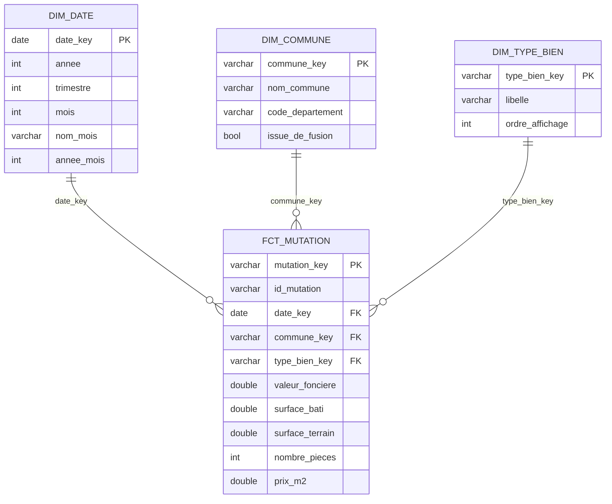

# Modèle de données

## Le schéma en étoile

## Le grain, et pourquoi c'est tout le sujet

**Une ligne de `fct_mutation` = une vente.**

Ce n'est pas le grain du fichier source. DVF éclate chaque vente sur plusieurs
lignes — une par lot, par parcelle ou par local — et **répète la valeur
foncière à l'identique sur chacune**.

Conséquence : `SUM(valeur_fonciere)` sur le fichier brut surestime le volume de
transactions d'un facteur 2 à 3. C'est l'erreur la plus fréquente sur ce jeu de
données, et elle est invisible — le chiffre obtenu est plausible, juste faux.

Le test `assert_valeur_fonciere_non_dupliquee` compare en permanence le total
au grain « vente » avec la somme naïve sur le même périmètre, et échoue si la
déduplication cesse de dédupliquer. `make verifier` affiche l'écart en clair.

## Règles de gestion appliquées

Toutes exposées en variables dbt (`dbt_project.yml`), donc modifiables sans
toucher au SQL.

| Règle | Valeur | Pourquoi |
|---|---|---|
| Nature de mutation | `Vente` uniquement | Une adjudication ou une expropriation ne reflète pas un prix de marché |
| Locaux bâtis par vente | exactement 1 | Sur une vente maison + garage, on ne sait pas répartir le prix : le prix au m² n'a pas de sens |
| Surface bâtie minimale | 9 m² | En dessous, c'est une cave ou un local technique mal typé |
| Prix au m² | entre 300 et 20 000 € | Écarte les ventes symboliques (1 €) et les erreurs de saisie |

Ces filtres écartent une part importante des lignes. C'est assumé : l'objectif
est un indicateur de prix au m² interprétable, pas l'exhaustivité comptable.

## Communes et fusions

`dim_commune` signale les communes portant la trace d'une ancienne entité via
`issue_de_fusion`. Les fusions de communes cassent les séries temporelles :
comparer un territoire de 2020 à sa version fusionnée de 2024 compare deux
périmètres différents.

Une véritable dimension à évolution lente (SCD2, avec dates de début et de fin
de validité) demanderait le Code Officiel Géographique de l'INSEE, qui date
chaque fusion. C'est la suite logique du projet — pas un oubli.

## Relations à créer dans Power BI

Toutes en **plusieurs à un**, **sens unique** (du fait vers la dimension) :

| Table de faits | → | Dimension |
|---|---|---|
| `fct_mutation[date_key]` | → | `dim_date[date_key]` |
| `fct_mutation[commune_key]` | → | `dim_commune[commune_key]` |
| `fct_mutation[type_bien_key]` | → | `dim_type_bien[type_bien_key]` |

Deux réglages à ne pas oublier, sans quoi les visuels sont faux :

1. **Modélisation → Marquer comme table de dates** sur `dim_date`, colonne
   `date`. Sans ça, `SAMEPERIODLASTYEAR` et les cumuls annuels renvoient
   n'importe quoi.
2. Sélectionner `dim_date[nom_mois]` → **Trier par colonne** → `mois`. Sinon
   Power BI affiche les mois par ordre alphabétique : avril, août, décembre…
